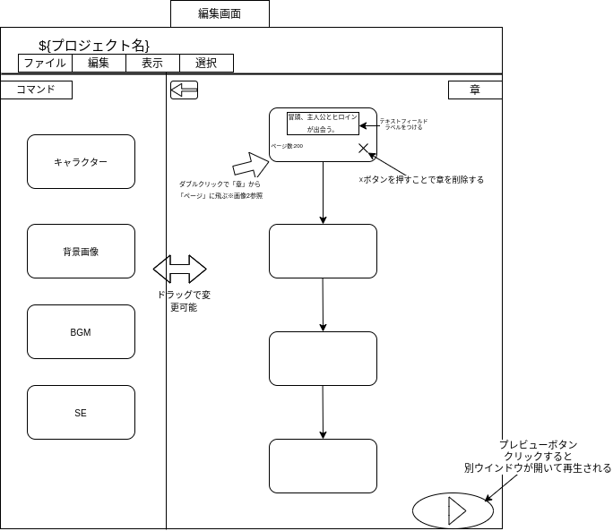
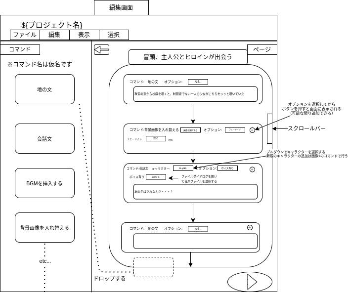

※2021年1月28日時点ではまだ未完成です。
### 流れ
- PeSuMi-editorで作成したゲームをPeSuMi(※開発中)で公開することができます。
###  名前の由来
- Picture(絵)のPi
- Music(音楽)のMu
- Sentence(文章)のSe
の母音と子音を分解して、それぞれを混ぜ合わせた造語
### 完成イメージ画像
以下の画像は、編集画面の完成イメージです
画像1

#### 補足説明
画像1の左側にあるコマンド一覧は、それぞれクリックすると設定画面に切り替わります
例えば、キャラクターを押すと、登場人物のリストを表示することができたり、キャラクターの立ち絵を管理したりできます。

画像2

### ライセンス
- No Licenseを元にし、PeSuMi(※開発中)で公開するために利用する場合のみ、商用利用できます。
- ソースコードや、バイナリの再配布は禁止しております。
- コントリビュートを目的としてのみ、ソースコードの改変を許可します。
- 商標（まだ商標とってません）、著作権その他の権利は、すべて[u-yas](https://github.com/u-yas)が所持しております。
